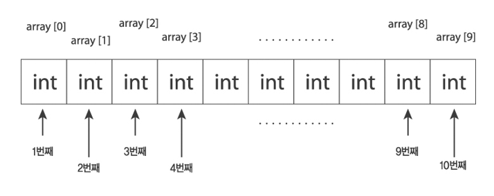

## 배열

<p align="center">
  
</p>

#### 배열 선언과 초기화
- 선언과 동시에 초기화

```
int[] numbers = {10, 20, 30, 40};
선언 후 초기화
```

```
int[] numbers;
numbers = new int[]{10, 20, 30, 40};
크기만 지정하고 초기화
```

```
int[] numbers = new int[4]; // 크기가 4인 배열
numbers[0] = 10;
numbers[1] = 20;
numbers[2] = 30;
numbers[3] = 40;
```

#### 배열의 크기와 요소 접근
- 크기 확인

```
int length = numbers.length;
System.out.println(length);
요소 접근
```

```
numbers = new int[]{10, 20, 30, 40};
int firstNumber = numbers[0];
System.out.println(firstNumber);
```
---

#### 다차원 배열
- 선언과 초기화

```
int[][] matrix = {
    {1, 2},
    {3, 4},
    {5, 6}
};

int number = matrix[1][0];
System.out.println(number);
```
---

#### 배열 순회
- for문 사용

```
for(int i = 0; i < numbers.length; i++) {
    System.out.println(numbers[i]);
}
for-each문 사용
```

```
for(int number : numbers) {
    System.out.println(number);
}
```
---

#### 배열의 정렬
- Arrays.sort 사용 (오름차순)

```
import java.util.Arrays;

int[] numbers = {6, 4, 2, 3, 5, 1};
Arrays.sort(numbers);
for(int number : numbers) {
    System.out.println(number);
}
```
---

#### 배열의 검색
- Arrays.binarySearch 사용 (정렬된 배열에서만)

```
int index = Arrays.binarySearch(numbers, 30);
```
---

#### 문자열 배열
- 선언과 초기화

```
String[] words = {"apple", "banana", "cherry"};
```

---
<!--목차 & 다음으로 페이지 이동-->
[목차](https://github.com/Devcurve/Java/blob/main/README.md)<br>
[이전 페이지](https://github.com/Devcurve/Java/blob/main/Markdown/string.md)<br>
<!--[다음 페이지](https://github.com/Devcurve/Java/blob/main/Markdown/array.md)-->
