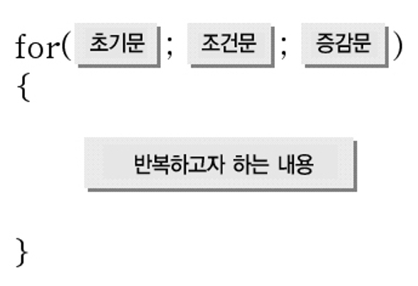

## for

<p align="center">
  
</p>

##### - `초기문` : int i = 0
##### - `조건문` : i < 10
##### - `증감문` : i++


```
for (int i = 0; i < 10 ; i++)
{
  System.out.println("hello world!!");
}
```
- 10회 반복되는 반복문
---

___예제___
- 구구단

```
for (int i = 2; i < 10 ; i++)
{
    for (int j = 1; j < 10 ; j++)
    {
        System.out.println(i + " x " + j + " = " + (i * j) );
    }
}
```
---
<!--목차 & 다음으로 페이지 이동-->
[목차](https://github.com/Devcurve/Java/blob/main/README.md)<br>
[이전 페이지](https://github.com/Devcurve/Java/blob/main/Markdown/dataType.md)<br>
[다음 페이지](https://github.com/Devcurve/Java/blob/main/Markdown/while.md)
