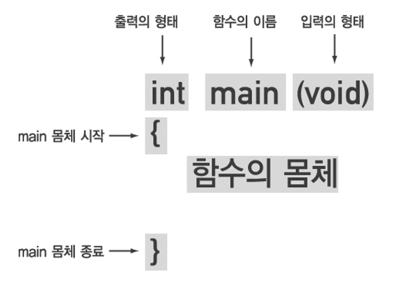

## 함수 function

<p align="center">
  
</p>

#### 출력의 형태 ___Return Type___
- 함수가 반환할 값의 타입을 의미합니다. 반환 값이 없을 경우 `void`를 사용하고, 특정 타입의 값을 반환할 경우 해당 타입을 명시해야 합니다.

```
public int add(int a, int b) {
    return a + b;
}
```

#### 함수 이름 ___Method Name___
- 함수를 호출할 때 사용하는 이름입니다. 자바에서는 카멜 케이스(camelCase)를 주로 사용합니다.

```
// printName = 함수 이름
public void printName(String name) {
    System.out.println(name);
}
```

#### 입력의 형태 ___Parameters___
- 함수에 전달되는 입력 값을 매개변수라고 합니다. 매개변수는 타입과 이름을 함께 선언하고, 여러 개의 매개변수를 콤마로 구분합니다.

```
// () 안에 포함되어있는 double radius, double height는 매개변수
public double calculateArea(double radius, double height) {
    return Math.PI * radius * radius * height;
}
```

#### 함수 몸체 ___Method Body___
- 함수가 호출되었을 때 실행되는 코드 부분 영역입니다. 중괄호 {} 안에 작성하며, 로직과 반환값(return) 등이 포함될 수 있습니다.

```
public String greet(String name)
{ <- 함수 몸체의 시작
    String greeting = "안녕, " + name + "!";
    return greeting;
} <- 함수 몸체의 끝
```


---

<!--목차 & 다음으로 페이지 이동-->
[목차](https://github.com/Devcurve/Java/blob/main/README.md)<br>
[이전 페이지](https://github.com/Devcurve/Java/blob/main/Markdown/array.md)<br>
[다음 페이지](https://github.com/Devcurve/Java/blob/main/Markdown/constructor.md)
