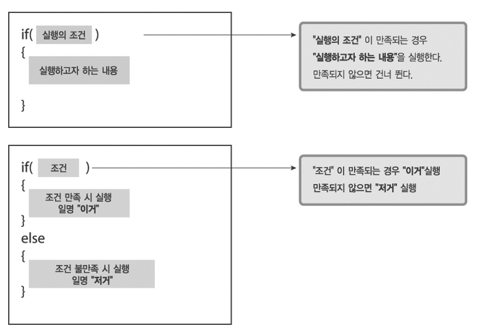
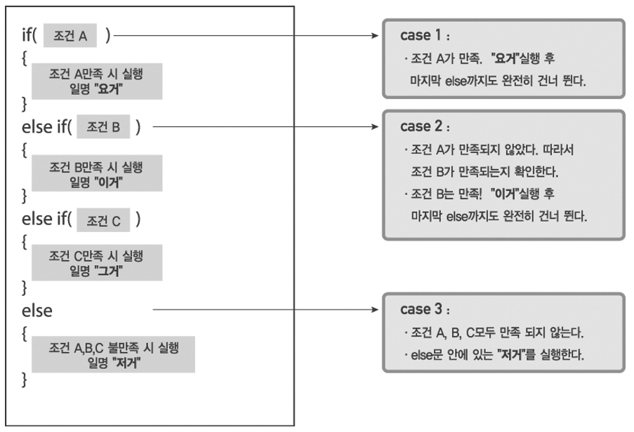
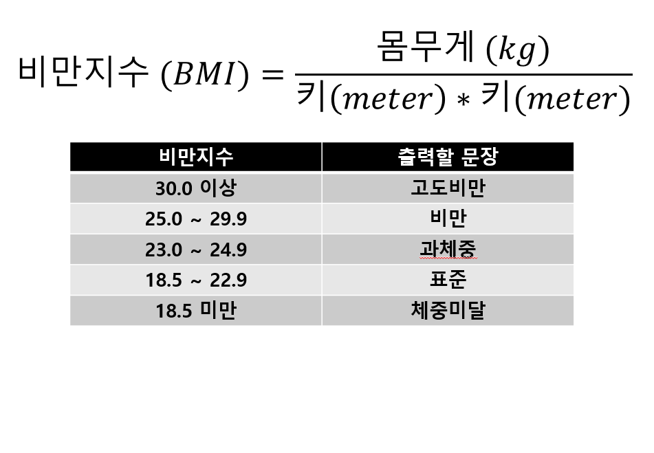

## 분기문
#### if-else

<p align="center">
  
</p>

___예제___

```
int num1 = 20;

if(num1%2 == 0) {
    System.out.println("짝 입니다.");
}
else {
    System.out.println("홀 입니다.");
    System.out.println("홀 입니다.");
}
```
<br>

- 음수인지 양수 인지 확인하는 코드 작성.

```
int num2 = 20;

if (num2 < 0) {
    System.out.println("음수 입니다.");
} else {
    System.out.println("양수 입니다.");
}
```

---
<p align="center">
  
</p>


- 학점

```
int num3 = 80;

if (num3 >= 95) {
    System.out.println("A 입니다.");
} else if (num3 >= 85) {
    System.out.println("B 입니다.");
} else if (num3 >= 75) {
    System.out.println("C 입니다.");
} else if (num3 >= 65) {
    System.out.println("D 입니다.");
} else {
    System.out.println("F 입니다.");
}
```

---
#### 문제

<p align="center">
  
</p>

---
<!--목차 & 다음으로 페이지 이동-->
[목차](https://github.com/Devcurve/Java/blob/main/README.md)<br>
[이전 페이지](https://github.com/Devcurve/Java/Markdown/operator.md)<br>
<!--[다음 페이지](https://github.com/Devcurve/Java/switch.md)-->
