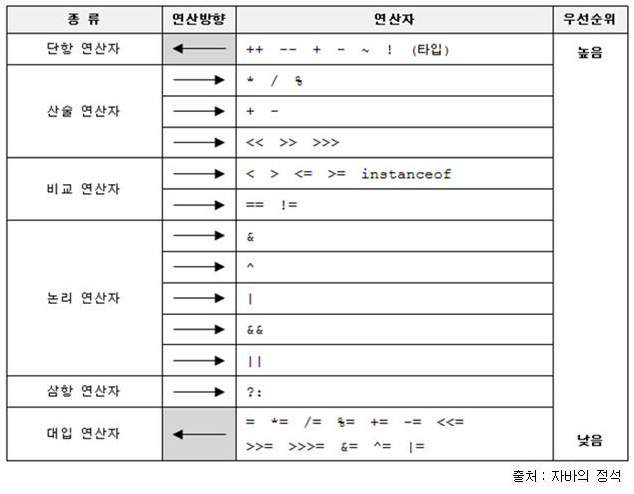

## 연산자 ___Operator___


#### 산술연산자
- `+` 더하기
```
int a = 5;
int b = 3;
int sum = a + b;
System.out.println("더하기 결과: " + sum); // "더하기 결과: 8" 출력
```
<br>

- `-` 빼기
```
int a = 5;
int b = 3;
int difference = a - b;
System.out.println("빼기 결과: " + difference); // "빼기 결과: 2" 출력
```
<br>

- `*` 곱하기
```
int a = 5;
int b = 3;
int product = a * b;
System.out.println("곱하기 결과: " + product); // "곱하기 결과: 15" 출력
```
<br>

- `/` 나누기
```
int a = 5;
int b = 3;
int quotient = a / b;
System.out.println("나누기 결과: " + quotient); // "나누기 결과: 1" 출력
```
<br>

- `%` 나머지
```
int a = 5;
int b = 3;
int remainder = a % b;
System.out.println("나머지 결과: " + remainder); // "나머지 결과: 2" 출력
```

---
#### 비교 연산자

- `>`:  A > B : A가 B보다 큰가?
```
int A = 10;
int B = 5;
boolean result = A > B; // true, A가 B보다 크기 때문에
```
<br>

- `<`:  A < B : A가 B보다 작은가?
```
int A = 5;
int B = 10;
boolean result = A < B; // true, A가 B보다 작기 때문에
```
<br>

- `<=`: A >= B : A가 B보다 크거나 같은가?
```
int A = 10;
int B = 10;
boolean result = A >= B; // true, A가 B와 같기 때문에
```
<br>

- `>=`: A <= B : A가 B보다 작거나 같은가?
```
int A = 5;
int B = 10;
boolean result = A <= B; // true, A가 B보다 작기 때문에
```
<br>

- `==`: A == B: A가 B와 같은가?
```
int A = 10;
int B = 10;
boolean result = A == B; // true, A와 B가 같기 때문에
```
<br>

- `!=`: A != B: A가 B와 다른가?
```
int A = 10;
int B = 5;
boolean result = A != B; // true, A와 B가 다르기 때문에
```
---
#### 논리 연산자

>- `&&`: AND 그리고
- `true` && `true` = `true`
- `true` && `false` = `false`
- `false` && `true` = `false`
- `false` && `false` = `false`
```
int A = 10;
int B = 5;
boolean result = (A > B) && (A > 0); // true, 두 조건 모두 참이기 때문에
```

---
>- `||`: OR  또는
- `true` && `true` = `true`
- `true` && `false` = `true`
- `false` && `true` = `true`
- `false` && `false` = `false`
```
int A = 10;
int B = 5;
boolean result = (A < B) || (A > 0); // true, 두 번째 조건이 참이기 때문에
```

---
>- `!`:  NOT  ~아니다. : A 가 아닐때
- `!true` = `false`
- `!false` = `true`
```
int A = 10;
int B = 5;
boolean result = !(A < B); // true, 조건이 거짓이므로 NOT 연산자가 참을 반환
```

---
#### 대입 연산자
- `=` 대입
```
int a = 5;
System.out.println("a의 값: " + a); // "a의 값: 5" 출력
```
<br>

#### 연산자 결합 사용
- `=+` 더하기
```
int a = 5;
a += 3; // a는 8이 됩니다.
```
<br>

- `=-` 빼기
```
int a = 5;
a -= 3; // a는 2가 됩니다.
```
<br>

- `=*` 곱하기
```
int a = 5;
a *= 3; // a는 15가 됩니다.
```
<br>

- `=/` 나누기
```
int a = 5;
a /= 3; // a는 1이 됩니다.
```
<br>

- `=%` 나머지
```
int a = 5;
a %= 3; // a는 2가 됩니다.
```
<br>

- `|=` 비트 OR 후 할당
```
int a = 5;
a ^= 3; // a = 6
```
<br>

- `^=` 비트 XOR 후 할당
```
int a = 5;
a ^= 3; // a = 6
```
<br>

- `<<=` 왼쪽 시프트 후 할당
```
int a = 5;
a <<= 2; // a = 20
```
<br>

- `>>=` 오른쪽 시프트 후 할당
```
int a = 20;
a >>= 2; // a = 5
```
<br>

- `>>>=` 오른쪽 시프트 (부호 없음) 후 할당 연산자
```
int a = -20;
a >>>= 2; // a = 1073741819
```
<br>

---
#### typeof 연산자
- `typeof` : 피연산자의 타입을 나타내는 문자열을 반환
```
String str = "hello world!";
System.out.println(str.getClass().getName()); // 출력: java.lang.String
```
<br>

---
#### 단항 연산자
###### [++] 증가 연산자
- 전위 연산 (++num): 변수의 값을 먼저 증가시킨 후, 그 값을 평가합니다.
```
int num = 5;
int result = ++num; // num은 6이 되고, result도 6이 됨
```
<br>

- 후위 연산 (num++): 변수의 현재 값을 평가한 후, 그 값을 증가시킵니다.
```
int num = 5;
int result = num++; // result는 5가 되고, num은 그 후에 6이 됨
```
<br>

###### [--] : 감소 연산자
- 전위 연산 (--num): 변수의 값을 먼저 감소시킨 후, 그 값을 평가합니다.
```
int num = 5;
int result = --num; // num은 4가 되고, result도 4가 됨
```
<br>

- 후위 연산 (num--): 변수의 현재 값을 평가한 후, 그 값을 감소시킵니다.
```
int num = 5;
int result = num--; // result는 5가 되고, num은 그 후에 4가 됨
```
<br>

---
#### 조건 연산자

- 조건 ? true : false

```
int score = 85;
String grade = (score >= 90) ? "A" : "B";
```

---
#### 연산자 우선순위

<p align="center">
  
</p>

---

<!--목차 & 다음으로 페이지 이동-->
[목차](https://github.com/Devcurve/Java/README.md)<br>
[이전 페이지](https://github.com/Devcurve/Java/variable.md)<br>
[다음 페이지](https://github.com/Devcurve/Java/ifElse.md)
