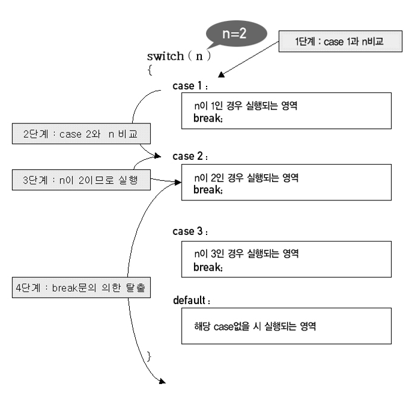
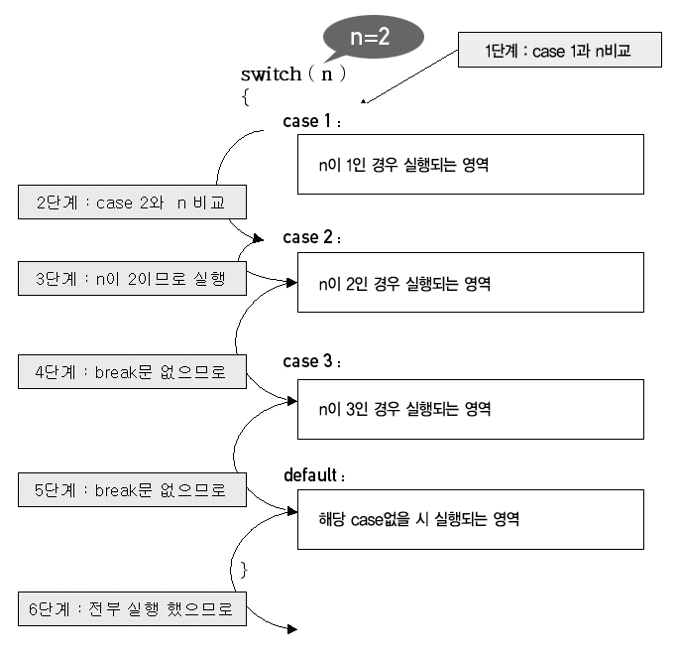
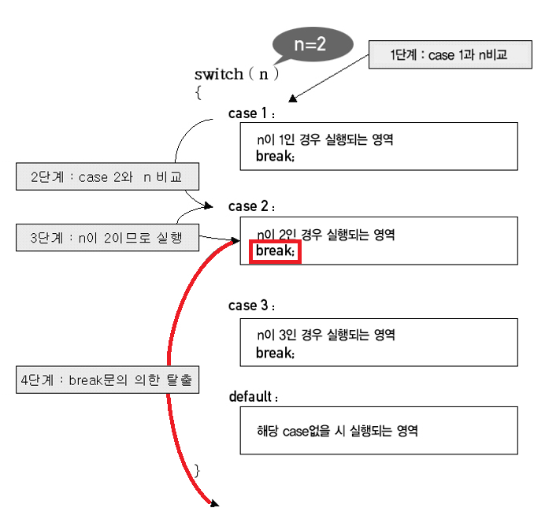
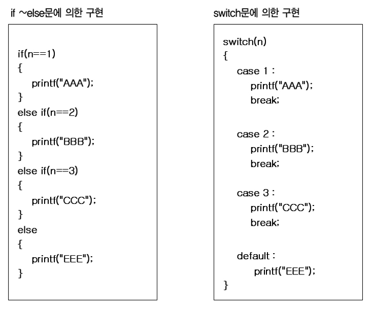

## 분기문
#### switch

- 사용방법

```
switch(조건)
{
    case (정수 & 상수):
      break;
}
```
<br><br>

- num의 값은 case의 같은 레이블을 찾아 실행시킨다.

```
int num = 0;

switch(num)
{
    case 1:
      // 코드 작성
      break;
    case 2:
      // 코드 작성
      break;
    case 3:
      // 코드 작성
      break;
}
```

<p align="center">
  
</p>

<p align="center">
  
</p>

---
___예제___
```
int month = 4;

switch(month)
{
    case 1:
        System.out.println(month + "월 입니다.");
        break;
    case 2:
        System.out.println(month + "월 입니다.");
        break;
    case 3:
        System.out.println(month + "월 입니다.");
        break;
    case 4:
        System.out.println(month + "월 입니다.");
        break;
    case 5:
        System.out.println(month + "월 입니다.");
        break;
    case 6:
        System.out.println(month + "월 입니다.");
        break;
    case 7:
        System.out.println(month + "월 입니다.");
        break;
    case 8:
        System.out.println(month + "월 입니다.");
        break;
    case 9:
        System.out.println(month + "월 입니다.");
        break;
    case 10:
        System.out.println(month + "월 입니다.");
        break;
    case 11:
        System.out.println(month + "월 입니다.");
        break;
    case 12:
        System.out.println(month + "월 입니다.");
        break;
}
```

---

#### break (탈출문)
- `break` 문은 반복문 또는 `switch` 문을 빠져나오는 데 사용되는 키워드 입니다. `break`문을 만나면 해당 `switch`문을 즉시 종료하고 `switch`의 종료 지점부터 다음 코드를 실행합니다.

<p align="center">
  
</p>

### - `break`문을 만나지 못한다면?

```
int month = 4;

switch(month)
{
    case 1:
        System.out.println("1 월 입니다.");
    case 2:
        System.out.println("2 월 입니다.");
    case 3:
        System.out.println("3 월 입니다.");
    case 4:
        System.out.println("4 월 입니다.");
    case 5:
        System.out.println("5 월 입니다.");
    case 6:
        System.out.println("6 월 입니다.");
    case 7:
        System.out.println("7 월 입니다.");
    case 8:
        System.out.println("8 월 입니다.");
    case 9:
        System.out.println("9 월 입니다.");
    case 10:
        System.out.println("10 월 입니다.");
    case 11:
        System.out.println("11 월 입니다.");
    case 12:
        System.out.println("12 월 입니다.");
}
```
- `month` 는 4이기 때문에 `case 4`의 레이블을 찾아 실행 후 `break`문을 만날때까지 나머지 코드를 실행합니다. 하지만 `break`문을 만나지 못한다면 남은 레이블에 있는 모든 코드를 실행 합니다. 현재 코드로 본다면 4부터 12까지 실행됩니다.

---
#### default
- 입력된 값이 없는 레이블을 가르키고 있다면 `default`문이 실행된다.

```
int number = 4;

switch(number)
{
    case 1:
        System.out.println("1 입니다.");
        break;
    case 2:
        System.out.println("2 입니다.");
        break;
    case 3:
        System.out.println("3 입니다.");
        break;
    default:
        System.out.println("입력값이 1~3 사이의 값이 아닙니다.");
        break;
}
```
---
#### if-else 문과 switch 문의 비교
<br>
<p align="center">
  
</p>

---
<!--목차 & 다음으로 페이지 이동-->
[목차](https://github.com/Devcurve/Java/blob/main/README.md)<br>
[이전 페이지](https://github.com/Devcurve/Java/blob/main/Markdown/ifElse.md)<br>
<!--[다음 페이지](https://github.com/Devcurve/Java/switch.md)-->
